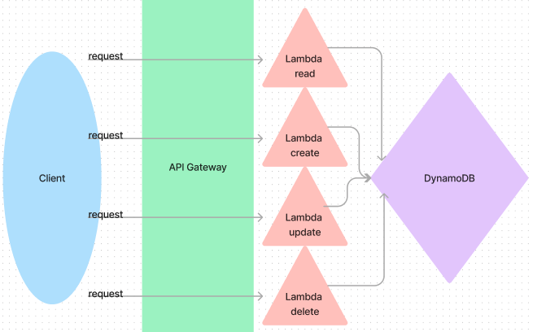

# AWS: API, Dynamo and Lambda

Create a serverless REST API.

## UML 

## Steps

- Go to DynamoDB and create table
- Go to API Gateway and create a resource (aka route) than attach a method (get,post,put,delete) onto the resource. If the resource needs parameters then add another resource into the resource (ex: route/id).
- Once you choose the method you will be prompted to enter a lambda function for execution. Check the proxy integration box and enter the functions name.
  - In my case I went to Lambda and wrote the function then came back to gateway and entered the name.
  - Next, I had to go into IAM and then roles to click on the function I just created and add a permission: AmazonDynamoDBFullAccess.
  - To start writing the function I uploaded a .zip file which is the easiest way to get node packages to work in AWS.

## Routing: API Gateway

CRUD Operation Handlers: Lambda Functions

- POST
/people - Given a JSON body, inserts a record into the database.
returns an object representing one record, by its id (##).

- GET
/people - returns an array of objects representing the records in the database.
/people/## - returns an object representing one record, by its id (##).

- PUT
/people/## - Given a JSON body and an ID (##), updates a record in the database.
returns an object representing one record, by its id (##).

- DELETE
/people/## - Given an id (##) removes the matching record from the database.
returns an empty object.

## Implementation Notes

Functions will need to be individually .zipped and deployed using common libraries (node_modules) and schema files.

Zip files containing code with non-AWS dependencies (dynamoose) need to include node_modules and package-lock.json in .zip.

- one table for one data model at Dynamo DB.
- dynamoose schema to define the structure of your table.
- lambda functions that will separately perform the proper CRUD operation on the database.
- routes using API Gateway.
- routes integrate with the appropriate Lambda function to perform the operation.
